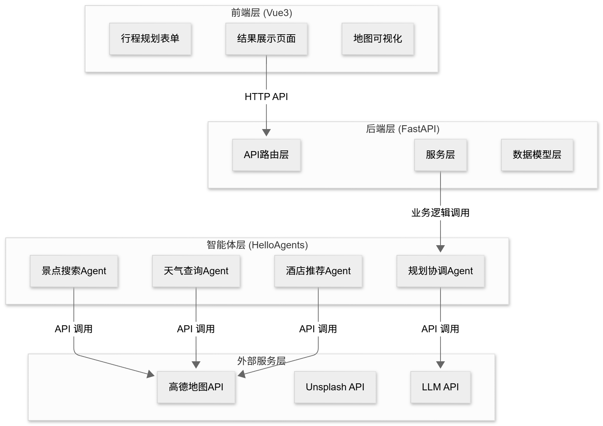
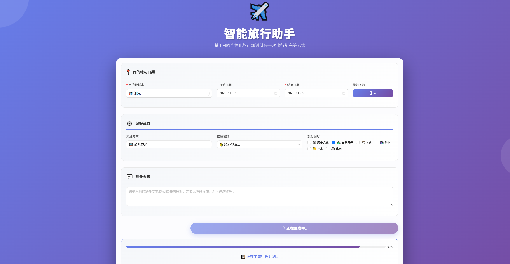
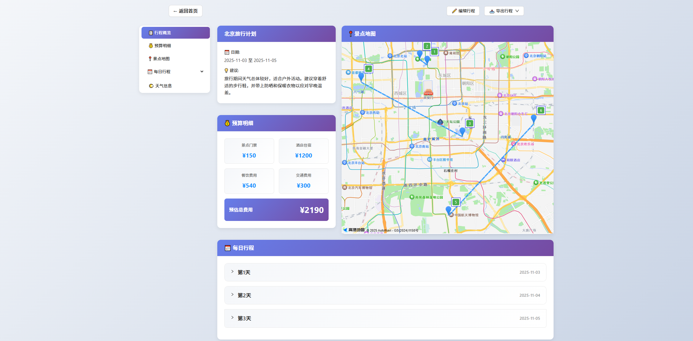
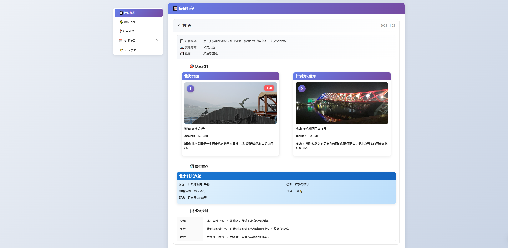
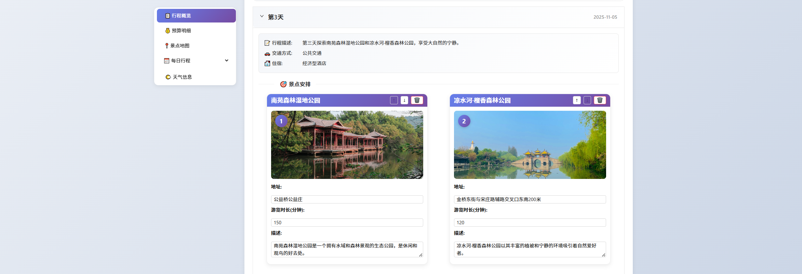

我想要写一份DEV_SPEC.md去指导一个Multi-Agent项目的全部开发流程:

项目是什么：
我们这个项目要做的是，基于这个文件夹：/Users/yukun/hello-agents/code/chapter13/helloagents-trip-planner，中已经做好的旅游规划助手项目，简称为hello agent项目，去做拓展。hello agent 项目已经实现了的功能是：
（1）智能行程规划：用户输入目的地、日期、偏好等信息，系统自动生成包含景点、餐饮、酒店的完整行程计划。

（2）地图可视化：在地图上标注景点位置、绘制游览路线，让行程一目了然。

（3）预算计算：自动计算门票、酒店、餐饮、交通费用，显示预算明细。

（4）行程编辑：支持添加、删除、调整景点，实时更新地图。

（5）导出功能：支持导出为 PDF 或图片，方便保存和分享。

这里是它的技术架构概览：

（1）前端层 (Vue3+TypeScript)：负责用户交互和数据展示，包括表单输入、结果展示、地图可视化。

（2）后端层 (FastAPI)：负责 API 路由、数据验证、业务逻辑。

（3）智能体层 (HelloAgents)：负责任务分解、工具调用、结果整合。包含 4 个专门的 Agent。

（4）外部服务层：提供数据和能力，包括高德地图 API、Unsplash API、LLM API。

这个项目的用户使用流程：首先需在首页表单中填写目的地城市、旅行日期、偏好、预算、交通及住宿类型等信息。点击“开始规划”按钮后，系统会显示加载进度条，并很快生成结果页面，如图所示：

随后加载成功，该页面会清晰展示行程概览、预算明细、景点地图、每日行程详情和天气信息：

如果用户需要个性化调整，可以点击“编辑行程”按钮，自由调整景点顺序或删除某个景点，如图 13.5 所示。规划完成后，通过“导出行程”下拉菜单，即可将最终方案轻松保存为图片或 PDF 文件，方便随时查阅。

关于hello agent项目的其他信息，请查阅：/Users/yukun/hello-agents/code/chapter13/helloagents-trip-planner/README.md

那我们这个项目需要如何拓展呢，我提出一下几点，这也是我的核心需求：
1：我需要新项目的agent工具都做成可插拔的。比如说获取景区照片的工具，默认使用unsplash的，但是也需要做成可插拔的去允许比如说google places api也可以接入使用。再比如说搜索和规划路线，除了默认的高德地图API，google map api也要能够使用。
2：所有的agent相关的实现都要使用langchain,langgraph家族的框架。
3：我需要在他们原有的agent架构的基础上添加一个flightAgent去按照用户填入的出发和返程日期还有目的地去筛选出所有符合标准的航班，需要使用API去实时搜寻航班信息，这个工具也要做成可插拔的。
4：我需要添加一个agent，是一个签证要求查询agent，功能就是去查阅指定的白名单中的网站，告诉用户去到目标国家所需要的签证要求。用户在前端会被要求上传国籍信息，该agent只有在跨国的行程中才会被唤醒调用。
5：该项目需要接入我做好的另一个mcp-rag项目:/Users/yukun/MODULAR-RAG-MCP-SERVER/README.md，然后需要有一个agent去负责用这个rag工具去阅读理解用户可能上传的行程单 / 机票 / 预订确认单，Agent 可以：自动提取航班信息，生成完整 itinerary，计算转机时间，自动提醒 check-in，检测是否有冲突。或者是用户上传一个旅行计划文档（用户自己写的），Agent 可以：优化行程，检查是否合理，自动补充景点，生成地图路线。
6：我需要在这个hello agent 项目的基础上加上一个orchestrator agent，他需要是augmented agent，能够理解用户的需求然后调用不同的worker agent工作。你需要精心设计它的提示词去让他好好工作。
7：hello agent 项目目前支持导出pdf的功能，我需要添加一个导出到google calendar的功能，你需要调用google calendar api去实现它。
8：这个项目的前后端，以及对前后端的测试都不需要太复杂，这主要是一个Agent和RAG项目。所以前后端可以大部分照搬hello agent 项目。唯一的要求是去修改前端的颜色，让它不要太花哨（目前是紫色和其他多种颜色的混合）
9：该项目中每个新加的agent都需要具备调用LLM，工具等的能力，他们能够自己思考下一步做什么，返回什么结果。所以每个agent都需要你精心设计一套提示词，你必须要使用我提供给你的skills去给他们设计提示词。
10: 虽然这个项目是要求你用langgraph+langchain实现, hello agent项目使用的是另外一套框架，但是有很多hello agent 项目已经实现了的东西你是可以直接照搬过来的，或者是改一种语言、框架之后拿过来用。比如说前端后端的代码和架构，hello agent 项目中现有的agent代码，提示词，api封装，工具封装和调用等等。我们这个项目要尽可能地去多从hello agent项目借鉴和搬运现有的代码。

在这份DEV_SPEC.md你必须清晰且明确地提到需要做这个项目的agent去使用在仓库中我提供好的skills去做每一项任务。流程是首先使用dev-workflow，然后按照dev-workflow这个skill中的要求和步骤去一步步运行其他的skills，每个skill中都会要求agent输出一些内容，比如说让用户确认是否执行该阶段等，所有的这些输出要求都不能被省略，必须严格按照这个skills的流程去执行。

请按以下结构来组织这份 DEV_SPEC:
1.**项目概述**:设计理念、项目定位
2.**核心特点**:每个亮点的简要说明
3.**技术选型**:各模块的详细设计
4.**测试方案**:测试理念、分层策略、质量评估
5.**系统架构与模块设计**:架构图、目录结构、模块职责、数据流
6.**项目排期**:分阶段拆解，每个子任务有验收标准